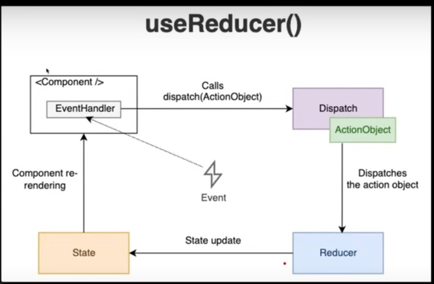
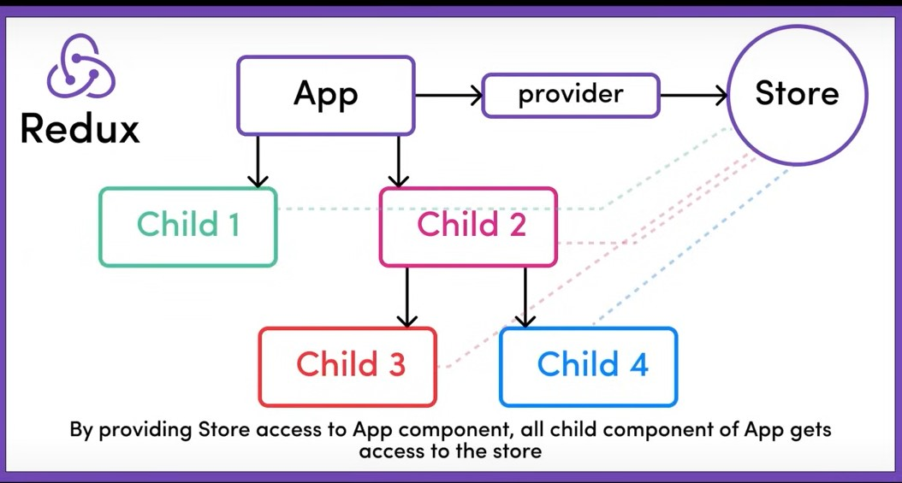
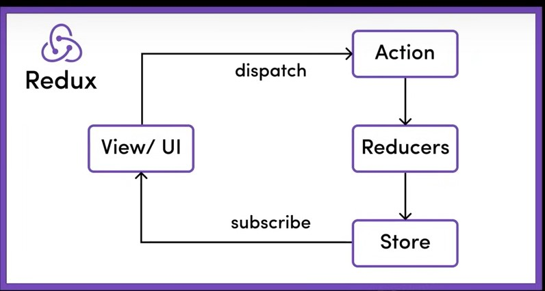

# React :
React is a library of Javascript which is used to make single page web application.
<br>
React application is tree of components with App component as the root bringing everything together.
<br>

# Features of React

1. React has simple mental model.
   <br>
2. No need to worry about querying and updating DOM.
   <br>
3. React creates a web page with small and reusable components.
   <br>
4. React will take care of creating and updating the dom element.
   <br>
5. React is declarative means we need to define the target UI state and react figures out how to reach that state while in JS we need to define the each steps to reach our desired state and dom manipulation in JS is also very difficult.
   <br>

# npx :

npx is a command-line tool that comes with Node.js, starting from version 5.2.0 of npm. It allows you to execute npm packages directly without installing them globally. This is particularly useful when you want to run a tool or package temporarily without polluting your global npm installs.

# Vite

Vite is a modern tool to create a react app while the official tool is CRA(create react app).
<br>
Vite produces Quick and small bundle size. It dynamically imports the module.
<br>
When a file is requested by the browser, Vite transforms it (e.g.,Convert React into JS), then serves it.

# Important Point from the React and Vite

```bash

//To create react project

npx create-react-app Test

// To create react + vite project
npm  create vite@latest Test


// After creating the project
Remove imports of App.css and index.css file from App.jsx and main.jsx(in case of vite) and index.js(in case of react).


// To run the project using Vite
npm run dev

// To run project using CRA
npm start

```

# Structure of React Project :

```bash
node_modules : contains all the installed modules required for the project.

public Directory : contains the static files that do not change.

src Directory/ :
Components : Reausable components

assets : Images fonts and other static files.

styles : CSS

package.json : package.json is a crucial file in any Node.js project that provides metadata about the project and handles the management of its dependencies.

package-lock.json : It provides a detailed snapshot of the entire dependency tree, including the specific versions of each installed package and their sub-dependencies. The main purpose of package-lock.json is to ensure consistent installs across different environments by "locking" the dependency versions.
vite.config.js : It contains vite config.

```

# jsx :

Javascript syntax execution
<br>

JSX (JavaScript XML) is a syntax extension for JavaScript that is primarily used with React to describe how the UI should look like. It allows you to write HTML-like syntax directly in JavaScript, which React transforms into JavaScript objects under the hood. JSX makes it easier to visualize the structure of your UI and is compiled by Babel or other tools into regular JavaScript.
<br>

```bash
1. What is JSX?
Definition: JSX determines how the UI will look wherever the component is used.

2. Not HTML: Though it resembles HTML, you're actually writing JSX, which stands for JavaScript XML.

3. Conversion: JSX gets converted to regular JavaScript.

4. Babeljs.io/repl is a tool that allows you to see how JSX is transformed into JavaScript.

```

<br>

In jsx , we can write javascript inside the html element using "{}". Here "{}" indicates js variables,function calls and more.
<br>

```bash
const name = 'John';
const greeting = <h1>Hello, {name}!</h1>;
```

<br>
In jsx , every html code must be enclosed in some opening and closing tag . This opening and closing tag may be like "<>" some html code "</>".

<br>
while write html empty tag like img tag. It is known as self closing tag. It must be written like :
<br>

```bash


```
<br>
```bash
// How to import image(jpeg or image file ):
import myImage from './image.png';
function App() {
  return ;
}


// How to import svg image 
import {ReactComponent as Logo} from './logo.svg';
function App() {
  return <Logo/>;
}
```


# Important Point from React (while using Bootstrap):

```bash 

Use "className" in place of "class". 

Use "to" instead of "href" in react. 

Use "Link" in place of "a" and to use "Link" we need to import :

"import {Link} from 'react' "

To use this we need to import :

import { BrowserRouter as Router, Routes,Route } from "react-router-dom";
and only then we can use Link.


Link is not used for the link that refers to the external page. like : We cannot provide "github" link in the "Link".

```


# In React (and JavaScript in general), there are two main types of imports:

1. Default Imports:
A default import allows you to import the default export from a module. In a module, there can only be one default export.

```bash

// File: App.js
export default function App() {
  return <h1>Hello, World!</h1>;
}

// File: index.js
import App from './App'; // 'App' is the default export of the 'App.js' file
```

<br>

2. Named Imports
   <br>
   A named import allows you to import specific exports from a module. These exports must be explicitly named in the module.
   A module can have multiple named exports, and you can import only the ones you need.
   Named imports must be imported using the same name as the export.
   <br>

```bash
// File: utilities.js
export function add(a, b) {
  return a + b;
}

export function subtract(a, b) {
  return a - b;
}

// File: index.js
import { add, subtract } from './utilities'; // Importing named exports from the 'utilities.js' file

```

<br>
<br>

```bash
// File: math.js
export default function multiply(a, b) {
  return a * b;
}

export function add(a, b) {
return a + b;
}

// export allows the use of components in other parts.

// File: index.js
import multiply, { add } from './math'; // Importing default and named exports

```


# React app components :
We can break the React App Components in two different ways :
1. Using function
<br>

2. Using class
<br>

```bash

Class Components:
• Stateful: Can manage state.
• Lifecycle: Access to lifecycle methods.
• Verbose: More boilerplate code.
• Not Preferred anymore.

Functional Components:
• Initially stateless which means we are not able to save some value in container like once we set the value to variable and when we dynamically want to change its value eg: onChange(event) then it does not work.

• Can use Hooks for state and effects.
• Simpler and more concise.
• More Popular.

```

# Important Point from React Components and CSS Used in React :

Components must be captialized while the lowercase is used for HTML.
<br>
In React, CSS can be directly imported into the component files allowing for modular and components specific styling.
<br>
we can write inline css in the react like "<pstyle={{'background-color':'aqua','width':'100vw','height':'10vh'}} > Hello World </p>"

# React Fragments :

Allows grouping of multiple elements without extra dom nodes.
<br>
Returns multiple elements without a wrapping parent.
<br>

```bash
<React.Fragment>
 <h2>Hello</h2>
 <p>World</p>
</React.Fragment>

or
<>... </>

```

# map method :

Purpose: Render list from array data.
<br>
It transfers the array item into jsx.
<br>
It also assigns unique key properties for optimized re-rendering. Because if we do not assign uinque key then React will update the whole list while adding new element into the array.  
<br>
React will add key to its virtual dom.
<br>

```bash
let items = ['item1','item2'];
<ul>

{items.map(item => <li key={item_id}>{item}</li>)}


</ul>

```

# Conditional Statement

```bash
// we can use the if-else statement  and it is chosed b/w to blocks of contents.

if(items.length ===0 ){
    return <h2>Items list is empty</h2>
}
else{
 return( <ul>
    {items.map(item => <li key={item_id}>item</li>)}
    </ul>
 )
}


// we can use ternary operator and it is quick option to choose b/w two options.
{items.length ===0?<h2>Items list is empty</h2>:null;}

// Logical operators and it is useful for rendering content when a condition is true.
{items.length ===0 && <h2>Items list is empty</h2>}
// In this case if the first condition is false then other condition will not checked and if the first conditon is true, only then other conditonal will checked and in this case statement inside the "h2" element will be rendered.

```

# Passing data via props :

props(short for properties) are used to pass data from a parent component to a child component in the form of objects. It is unidirectional (downwards).
<br>
Props are immutable.
<br>
It is defined as attributes in jsx.

# CSS Modules :

Localised class names to avoid global conflicts.
<br>
Styles are scoped to individual components.
<br>
Automatically generates uniquely class name.
<br>
Promotes modular and maintainable CSS.
<br>

```bash

1. creates a CSS File like "Component_Name.module.css".

2. We can import it like "import styles from 'Component_Name.module.css' ".

// we can use like 
<div className={`card ${styles.postcard} mt-4 mb-3`}></div>
```

# Passing Children via props

```bash

export default function Container(props){
  return(
    <div class="container-style">
      {props.children}
    </div>
  );
}


// App.jsx
import Container from './Component.jsx';

export default function App(){
  return(
    <Container>
      <h1>Welcome to My App</h1>
      <p>This content is passed as children to the Container Component.</p>
    </Container>
  )
}

```

<br>
1. children is a special props for passing elements into components. 
<br>
2. Used for flexible and reusable component design. 
<br>
3. Accessed with "props.children". 
<br>
4. Can be any content : string, number, jsx, components.

# Event Handling

1. React event use camelCase, e.g:onClick().
   <br>
2. Uses SyntheticBaseEvents, React will convert direct browser events into SyntheticBaseEvents for cross-browser consistency and performance improvements.
   <br>
3. Event Handlers can be function or arrow function.
inputs.
   <br>
5. Avoid Inline arrow functions in jsx for performance.
   <br>

```bash

// onClick Event function
function eventHandler(event){
  console.log("event handled");
  console.log(event.target.value);
}
<button onclick={(event)=>eventHandler(event)}></button>


// onChange Event function
<input type="text" onchange={(event)=>eventHandler(event)}>
//here onChange() means that an event is occured when user type any key to give the input in the input field.


```

# Passing function via props :

Pass dynamic behaviour between components.
<br>
Enables upward communication from child to parent. It means we pass the event from child to parent. 
<br>
Commonly used for event handling.
<br>
Parent defines function and child invokes it.
<br>
Enhances Components Interactivity.
<br>

```bash

// onClick Event in child component
export default function Child({eventHandler}){
  return(
  <button onclick={eventHandler}>Button</button>
  )
}

// Parent Component
export default function Parent(){


  function eventHandler(event){
    console.log("event handled");
    console.log(event.target.value);
  }

  return (
    < Child eventHandler={eventHandler} />
  )
}


```

# Different Types of Event : 
```bash 

// To track the keyEvent 
onKeydown((event) => console.log(event))


```
# spread operator and Functional updates :
spread operators : Used to maintain immutability while updateing array or objects . 
But sometime it gives old values even after updation. 
It is caused because React is async in nature. 
<br>
```bash 

let items = ["item1","item2"];
let newOne = "item3";
let newItem = [...items,newOne]

```
<br>
Functional updates : 
<br>
To avoid unexpected results, use:
<br>  
```bash
const currentValue = [{ name: "John", dueDate: "23-02-2025" }];

const newValue = (currentArray) =>{
  return  [...currentArray, { name: "David", dueDate: "23-02-2025" }]
};

const updatedArray = newValue(currentValue);

console.log(updatedArray);
```
<br>
To avoid stale values during asynchronous updates. 


# Managing State 
state represents data that changes over time.
<br>
State is a local and private to that component. 
<br>
State changes causes the component to re-render. 
<br>
For Functional component, use the "useState" hook. 
<br>
React Functions that starts with "use" words are called hooks. It is basically a inbuilt react function component.  
<br>
Hooks should be used inside the Functional Component.
<br>
Parent components can pass state down to children via props. 
<br>
Lifting State Up : share state between components by moving it to their closest ancestor. (means we need to manages the state above and closest to those component which requires it.)

# State Vs Props 
<b>State : </b>
1.Local and mutable data inside Components.
<br>
2. Initialized within the component. 
<br>
3. Can Change over time and It causes re-render when updated. 
<br>
4. It is managed using "useState()". 
<br>
<b>Props : </b>
1. It is immutable in the receiving component. 
<br>
2. Passed into components from its parent. 
<br>
3. Changes in props can also cause re-render. 
<br>
4. Allows to parent-to-child component communication using "props" or we can destructure the props into an object. 


# useState hook :

The React useState Hook allows us to track state in a function component.
<br>
State generally refers to data or properties that need to be tracking in an application.
<br>
We initialize our state by calling useState in our function component.
<br>
useState accepts an initial state and returns two values:
<br>
1.The current state.
<br>
2.A function that updates the state.
<br>
Example :
const [color, setColor] = useState("");
<br>
The first value, color, is our current state.
<br>
The second value, setColor, is the function that is used to update our state.
<br>
The useState Hook can be used to keep track of strings, numbers, booleans, arrays, objects, and any combination of these!
<br>
We could create multiple state Hooks to track individual values.
<br>
Disadvantage of useState: 
<br>
whenever the state is changed then component using that useState wiil be repaint. 

# Important Point from Input :
If we are using useState() in the input then we need to either assign the values properly or assign nothing.
<br>
When we use "useState" to update the state on the basis of input value and input value will be updated according to the state then it is called two-way binding. 


# React Icon Library 
we can use a lot of icons without managing them. 
<br>
```bash 

// install package
npm install react-icons --save 

--save :  to include the package in package.json under "dependencies"

// use icons 
import {IconName} from 'react-icons/fc';

```


# How React Works :

<b>Root Component: </b>
The App is the main or root component of a React application.
• It's the starting point of your React component tree.

<br>
<b>Virtual DOM:</b>
<br>
• React creates an in-memory structure called the virtual DOM.
The Virtual DOM is stored in JavaScript memory (RAM) as a JavaScript object. It exists within the heap memory of the JavaScript runtime environment 
<br>
• Different from the actual browser DOM.
<br>
It's a lightweight representation where each node stands for a component and its attributes.
<br>
<b>Reconciliation Process:</b>
<br>
• When component data changes, React updates the virtual DOM's state to mirror these changes.
• React then compares the current and previous versions of the virtual DOM.
• It identifies the specific nodes that need updating.
• Only these nodes are updated in the real browser DOM, making it efficient.

<br>

# React Libraries :
React and ReactDOM:
The actual updating of the browser's DOM isn't done by React itself.
• It's handled by a companion library called react-dom.
<br>
Root Element:
<br>
• The root div acts as a container for the React app.
• The script tag is where the React app starts executing.
• If you check main.jsx, the component tree is rendered inside this
root element.
<br>
Strict Mode Component:
<br>
• It's a special component in React.
Doesn't have a visual representation.
Its purpose is to spot potential issues in your React app.
<br>
Platform Independence: 
React's design allows it to be platform-Independent.
• While react-dom helps build web Uls using React, React Native can be used to craft mobile app UIs.

# React Vs Angular and Vue.js 
```bash 

React, Angular, and Vue:
React is a library while Angular and Vue.js are frameworks. 
React focuses on UI; Angular and Vue.js offer comprehensive tools for full app development.


Library vs. Framework:

A library offers specific functionality.

A framework provides a set of tools and guidelines.

• In simpler terms: React is a tool; Angular and Vue.js are toolsets.

React's Specialty:
React's main role is crafting dynamic, interactive UIs.
• It doesn't handle routing, HTTP calls, state management, and
more.

React's Flexibility:
• React doesn't dictate tool choices for other app aspects. Developers pick what fits their project best.

About Angular and Vue.js:
Angular, developed by Google, provides a robust framework with a steep learning curve.
Vue.js is known for its simplicity and ease of integration, making it beginner-friendly.

```
# Use of forms in React :
```bash 

1. State Management: Each input's state is stored in the component's state.

2. Handling Changes: Use onChange to detect input changes.

3. Submission: Utilize onSubmit for form submissions and prevent default with event.preventDefault().

4. Validation: Implement custom validation or use third-party libraries.

```

# useRef :
It is used when we want to manage the state but we don't to repaint the component every time when state is changed. It is mostly used in forms.
<br>
```bash 

1. useRef allows access to DOM elements and retains mutable values without re-renders.

2. Used with the ref attribute for direct DOM interactions.

3. Can hold previous state or prop values.

4. Not limited to DOM references; can hold any value.

5. Refs can be passed as props also. 

```

# Context API :
It is basically a common Shared storage among all the components. It is used when several components are using same methods or state then we use context api. 
<br>

<br>
```bash 

1. Prop Drilling: Context API addresses prop drilling; component composition is an alternative.
2. Folder Setup: Use a store folder for context files.
3. Initialization: Use React.createContext with initial state and export it.
4. Provider: Implement with contextName.Provider in
components.
5. Access Value: Use the useContext hook.
6. Dynamic Data: Combine context value with state.
7. Export Functions: Context can also export functions for actions
8. Logic Separation: This helps keep the UI and business logic separate from each other.


createContext() is a built-in function that we use to create a Context object. This Context object allows you to share values (data) between components. 


UserContext.Provider is a React component that comes from calling createContext(). It's part of the Context API, and its job is to "provide" a value (like user data) to all components inside it.(In place of UserContext there can be any other name).

```
<br>
Disadvantages: 
Everything inside the contextName.Provider will be repaint when its value is changed. 

# useReducer :
It is used when updating the state is complex in place of useState.
<br>

<br> 
```bash 
A pure function which does not have a side effect. It takes the argument and returns the output. 


1. useReducer is a hook in React that offers more control over state operations compared to useState, especially for complex state logic.

2. Components: It involves two main components:
• Reducer: A pure function that takes the current state and an action and returns a new state. Here action can be an object describing what happened, typically having a type property.

• intialState : It stores the inital Value/State. 

3. Initialization: It's invoked as
const [state, dispatch] = useReducer(reducer, initialState).

Here overall "useReducer()" returns new state and dispatch function. 


4. Dispatch: Actions are dispatched using the dispatch
function, which invokes the reducer with the current state and the given action.

5. Use Cases: Particularly useful for managing state in large components or when the next state depends on the
previous one.

6. Predictable State Management: Due to its strict structure, it leads to more predictable and maintainable state management.

  
```


# Working with API data:
Using Dummy JSON :
<br>
<b>How to Fetch data using "fetch" method</b>
<br>

```bash 

1. fetch: Modern JavaScript API for network requests.
2. Promise-Based: Returns a Promise with a Response object.
3. Usage: Default is GET. For POST use method: 'POST'
4. Response: Use .then() and response.json() for JSON data. 
5. Errors: Doesn't reject on HTTP errors. Check response.ok. 
6. Headers: Managed using the Headers API.

```
<br>
```bash 

// Fetch data using "GET" method (bydefault)
fetch('https://dummyjson.com/posts') 
// return promise and if promise is fullfilled then returns response
.then(res =>  res.json)
// return promise and if promise is fullfilled then returns response.json
.then(obj => console.log(obj.posts));


// Post data using fetch 

  fetch('https://dummyjson.com/posts/add', method:'POST',
            headers:{ 'Content-Type': 'application/json' },
            body:JSON.stringify({
                title: postTitle,
                body: postContent,
                reactions: reactions,
                userID: userID,
                tags: postTags
            })
        ).then(res => res.json())
            .then(post => addPost(post))

```

# useEffect hook

In React, useEffect is a hook that lets you perform side effects in functional components. It's useful for things like fetching data, interacting with browser APIs, subscribing to services, or manipulating the DOM directly. It runs after the component renders and can be set to re-run based on changes to specific state or props.
<br>

```bash
useEffect(effectFunction, dependencies);

//effectFunction: The function that contains the side-effect logic.

//dependencies (optional): An array of values that the effect depends on. React will re-run the effectFunction whenever any value in this array changes.

```
<br>

```bash 

1. In function-based components, use Effect handles side effects like data fetching or event listeners. 

2. useEffect runs automatically after every render by default.

3. By providing a dependency array, use Effect will only run when specified variables change. An empty array means the effect runs once at initial render.

4. Multiple useEffect hooks can be used in a single
component for organizing different side effects separately.
```

# useEffect Hook Clean Up 
```bash 

UseEffect(() => {
    const timerID = setInterval(() => {
    // do something

    }, 1000);


    // This is the cleanup function
    return () => {
    clearInterval(timerID);
    }
  }, []);

  
  // A Returning a function from `use Effect' allows for cleanup, ideal for removing event listeners.

```
<br>

```bash 

const [fetching, setFetching] = useState(false);


useEffect(() => {
    setFetching(true);

    const controller = new AbortController();
    const signal = controller.signal; // signal is a member of controller

    fetch('https://dummyjson.com/posts',{signal})
        .then(res => res.json())
        .then(data => {
        addInitialPosts(data.posts);
        setFetching(false);
        }
    );


    // cleanup function
    return () =>{
        controller.abort();
    }
    
}, []) // render only once initially.


// here "controller.abort()" will abort the api calls. 


```


# Handling Loading State :
When we fetch the data from any api then before obtaining the data, we get unexpected results(like "no posts to display" even there are post on the server) because we want make decision afer the data fetched from api. 
<br>
To avoid unexpected results:
<br>
We use Loading spinner before the data obtained from the server. 


# useCallback hook :
The useCallback hook memoizes a function, preventing it from being recreated on every render unless its dependencies change. It's useful for performance optimization, especially when passing functions to child components.
<br>
```bash 
useCallback(function,[dependencies])

// It will change the function reference when the value of dependencies changes. 

```
<br>
```bash 

1. Memoization: Preserves function across renders to prevent unnecessary re-renders. 

2. Optimization: Enhances performance in components with frequent updates.

3. Dependency Array: Recreates the function only when specific dependencies change.

4. Event Handlers: Used to keep consistent function references for child components.

5. With useEffect: Prevents infinite loops by maintaining function references.

```

<br>
```bash 

const deletePost = useCallback((postid) => {
  const deletePostAction = {
      type: "DELETE_POST",
      payload: {
          id:postid
      }
  }
  
  dispatchList(deletePostAction);
},[dispatchList])


// Here "deletePost" depends only on "dispatchList" funtion 
// if it changes,only then function references will be changes otherwise not. (In general whenever we pass any function to any component as props its references always changes so it causes unnecessary repaint ).
//a new function is created every time the component renders — even if the function looks exactly the same.

```

# useMemo Hook :
The useMemo hook memoizes a computed value, preventing expensive recalculations on every render unless its dependencies change. It is useful for optimizing performance, especially when dealing with heavy computations or derived state.
<br>
```bash 

1. Memoization: useMemo caches the result of
expensive calculations to enhance performance. 

2. Re-computation: Only re-computes the memoized value when specific dependencies change. 

3. Optimization: Helps prevent unnecessary recalculations, improving component rendering efficiency.


4. Dependency Array: Uses an array of
dependencies to determine when to recompute the cached value.

5. Comparison with useCallback: While useCallback memoizes functions, useMemo memoizes values or results of functions.

6. Best Use: Ideal for intensive computations or
operations that shouldn't run on every render.

```
<br>
```bash 
const memoizedValue = useMemo(() => computeExpensiveValue(), [dependencies]);

// The function inside useMemo only runs when dependencies change.
// If the dependency array [] is empty, it only runs once. 

```

<br>


```bash 

const arr = [12,31,11,10,21];
const sortedArr = useMemo(()=> arr.sort(),[arr]);

// here sorting will be only done when the value of array changes otherwise not. 


```

# Custom Hook :

```bash 

1. Reusable Logic: Custom hooks allow you to
extract and reuse component logic across multiple components.

2. Naming Convention: Typically start with "use" (e.g., useWindowSize, use Fetch).

3. Combining Hooks: Custom hooks can combine multiple built-in hooks like useState, useEffect,
and others.

(imp)4. Sharing State: Enables sharing of stateful logic without changing component hierarchy.

5. Isolation: Helps in isolating complex logic, making components cleaner and easier to maintain.

6. Custom Return Values: Can return any value
(arrays, objects, or any other data type) based on requirements.

```

<br>
```bash 

const [value,toggle] = useToggle(true);
// We can make custom hooks like "useToggle" using "useState" hook.

const [value,{on,off,toggle}] = useBoolean(true);

// we can make this type of custom hooks.
```

# React Router 
```bash 

1. Installation: Use npm install react-router-dom.

2. We are going to use the latest version which is 6+ 

3. RouterProvider: Wraps the app for routing capabilities. 

4. createBrowserRouter: helps creating the mapping for router provider.

5. Declarative Routing: Easily define application routes.

6. Routes are React components.

```

# Layout Routing :
```bash 

export default function Router() { 
  return useRoutes ([{
path: '/dashboard',element: <DashboardLayout />,children: [
{ element: <Navigate to="/dashboard/app" replace />},
{ path: 'app', element: <DashboardApp /> },
{ path: 'user', element: <User /> },
{ path: 'products', element: <Products /> },
{ path: 'blog', element: <Blog /> }
]
}

//"<Navigate to="/dashboard/app" replace />"
//  when the user goes to /dashboard, they get redirected to /dashboard/app


// Important Point : 
1. Layout Routes help us to use shared elements
2. Outlet component is used to render the children at the correct places

```

# Route Link :
```bash 

import { useNavigate } from "react-router-dom"; // v6
const Component = () => {
// Triggers re-renders on every path change

    const navigate=useNavigate();
    ... 
}

//  useNavigate() hook returns a method which can be used to navigate. 


// Important Point :
1. Link Component with to property can be used to avoid reloading 
2. useNavigate hook can be used to do navigation programmatically.

```


# useLoaderData Hook 
```bash 

1. Loader method can be used to load data before a particular route is executed.

2. The loader method must return the data that is loaded or promise.

3. Data is available in component and all the child components.

4. useLoaderData hook can be used to get the fetched data.

5. Loading state can also be used.

```
<br>
```bash 
const router = createBrowserRouter([
{ path: '/', element: <PostList />, loader:loadData }
]);


export const loadData = () =>{
  return fetch('https://dummyjson.com/posts')
  .then(res => res.json())
  .then(data => {
      return data.posts;
      
  }
  );
}

```


# Submitting Data using Fetch : 

```bash 

1. Action method can be used to perform an action on submission of Forms.

2. Custom Form component need to be used along with name attribute for all inputs. 

3. Action function will get an data object. To generate correct request object, method="post" attribute should be used.

 4. Data.request.formData() method can be used to get form data Object.

5. Object.fromEntries(formData) can be used to get actual input data.

6. redirect() : response can be returned for navigation after submission.

```
<br>

```bash 

export async function postDataAction(data) {

  const FormData = await data.request.formData();
  console.log(FormData);
  const postData = Object.fromEntries(FormData);
  postData.tags = postData.tags.split(" ");

  const CompletePostData = {
      ...postData,  
      reactions: { likes: 10, dislikes: 0 }, 
      userId: 5,  
      views: 23  
  };


  fetch('https://dummyjson.com/posts/add', {
      method: 'POST',
      headers: { 'Content-Type': 'application/json' },
      body: JSON.stringify(CompletePostData)
  }).then(res => res.json())
      .then(post => {
          console.log(post);
          // addPost(post);
      })

  return redirect('/')

}

```

# useForm :
useForm state is used for the form validation.
<br>
It require "react-hook-form"
<br>
It returns an object with several useful methods and properties for managing forms efficiently.
<br>
```bash 
const {
  register,        // Funtion to Registers input fields
  handleSubmit,    // Funtion to Handles form submission
  watch,           // Funtion to Watches field values
  setValue,        // Funtion to Manually sets a field's value
  getValues,       // Funtion to Retrieves current form values
  reset,           // Funtion to Resets form fields
  trigger,         // Funtion to Manually triggers validation
  control,         // Property Used with Controller for UI libraries
  formState: {
    errors,        // Property : Holds validation errors
    isValid,       // Property : Boolean indicating if the form is valid
    isDirty,       // Property : Boolean indicating if any field was changed
    isSubmitting,  // Property : Boolean indicating if form is submitting
    touchedFields, // Property : Tracks touched fields
    dirtyFields,   // Property : Tracks modified fields
  }
} = useForm();

// here register function is important and formState properties are important.  

```
<br>
```bash 
import { useForm } from "react-hook-form";

const OptimizedForm = () => {
  const {
    register,
    handleSubmit,
    formState: { errors },
  } = useForm(); // Efficient state management

  const onSubmit = (data) => {
    console.log("Form Data:", data);
    alert("Form submitted successfully!");
  };

  return (
    <form onSubmit={handleSubmit(onSubmit)}>
      <div>
        <label>Email:</label>
        // "email" in the register function is name. 
        <input type="email" {...register("email", { required: "Email is required", pattern: { value: /\S+@\S+\.\S+/, message: "Invalid email" } })} />
        <span style="color:red" >{errors.email?.message}</span>
      </div>

      <div>
        <label>Password:</label>
        <input type="password" {...register("password", { required: "Password is required", minLength: { value: 6, message: "Min length is 6" } })} />
        <span style="color:red">{errors.password?.message}</span>
      </div>

      <button type="submit">Submit</button>
    </form>
  );
};

export default OptimizedForm;

```
<br>
```bash 
required :	Field must not be empty.
minLength:	Minimum character length.
maxLength:	Maximum character length.
pattern	: Uses regex for validation.
validate:	Custom validation function.

```

# Redux : 

<br>
Redux is a predictable state management Library used in React for cross component or app-wide state. 
<br>
<b>Local State</b> : State that belongs to a single component and does not affect others.
<br>
like useState() or useReducer inside a component. 
<br>
<b>Cross-Component State</b> :
State that needs to be shared between multiple components.
<br>
like useState() with prop drilling 
<br>
<b>App-wide State</b>: 
State that is accessible anywhere in the application.
<br>
like useContext or Redux. 

# useContext vs Redux :
```bash 

1. we can use both.

2. Setup and Coding is tough especially if we have multiple context providers.

3. Performance is slow. Context should only be used for things that rarely change because on change in the context provider value the entire app will be repaint. On the other hand Redux has great performance.

4. If these things don't matter to us then we can choose not to use redux and stay with React Context.

```
# How Redux works : 


```bash 

1. Single Store: Redux uses a single central store to maintain the entire application's state.

2. Actions: Components never directly change the store. Changes to state are made through dispatched actions, which describe events. 

3. Reducers: Actions are processed by reducers, pure functions that return the new state.

4. Immutable: State is immutable; every change results in a new state object.

5. subscribe: It is a consumer method which is used by the components to get the data from the store and store remembers that which data is taken by the component and tells the component when data is changed.  

6. This is different from useReducer hook.
```
<br>

# Work with Redux in node project :
```bash 

1. npm init -y
2. npm install redux
3. import in node Const redux = require('redux'); 
4. We need to setup all 4 basic things:
1. Reducer
2. Store
3. Subscriber
4. Actions

5. Node redux-demo.js command to run node server

```

# Work with Redux in react application :
```bash 

1. Npm install redux 
2. Npm install react-redux
3. Create store folder with Index.js file 
4. Creating the store using
Import {createStore} from redux.
5. Providing the store with react
(I). Provider from react-redux
(II). <Provider store={store}><App /></Provider> 
6. Using the store
(I). useSelector hook gets a slice of the store.
Const counter = useSelector(state => state.counter); 
(II). Subscription is already setup and only will re-execute when only your slice is changed. Subscription is automatically cleared also when it is out of memory.
7. Dispatch Actions using the use Dispatch hook.
```

# Why Redux ToolKit : 
```bash 

1. Action types are difficult to maintain.

2. Store becoming too big. 

3. Mistakenly editing store 

4. Reducer becoming too big

```
# Advantage of Reduxjs toolkit: 
```bash 
Redux toolkit allows us to create multiple chunks of store and then combine them. 

Redux toolkit allows us to create multiple reducers . 

```

# Working with Reduxjs toolkit in react application : 
```bash 

1. Npm install @reduxjs/toolkit

2. Remove redux from package.json

3. Import {createSlice} from "@reduxjs/toolkit"

4. Slices of the store can be created using the following syntax:

const slice = createSlice({
  name:"counter",
  initialState:{counter:0},
  reducers:{
  increment: (state)=>{
   state.counter++ }
  }
})

export slice;

// how to use the state 
const {countVal} = useSelector(store => store.slice);

5. ConfigureStore combines multiple reducers and can be used as:
configureStore({
  reducer: {counter: slice.reducer}
})

// here counter comes from the name attribute of Slice of counter

6. Export actions = slice.actions;

7. Actions can be dispatched like: actions.reducerMethod(payload);


Note : Bydefault in redux's reduce expression is considered as return statement so we do not need to explicitly write return But if the returns statement is not a expression then we need to explicitly write return. 

```
